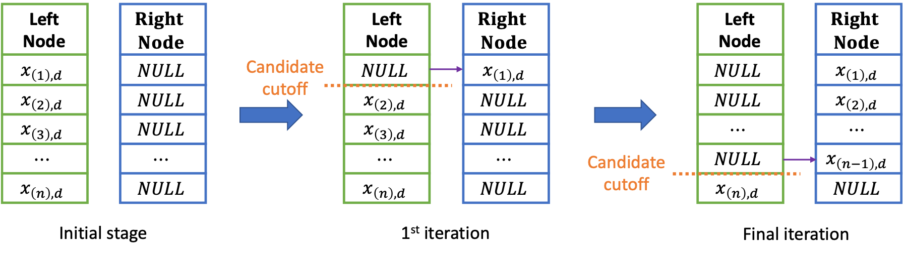
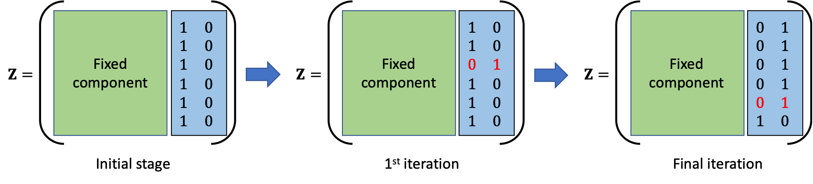
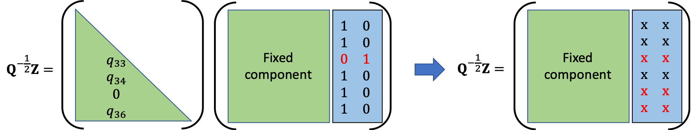

# Summary

Dependent data are often analysed with linear mixed-models to accommodate both fixed (covariate) and random (dependency) effect. In this model, the covariate effect is captured through a linear function of the covariates themselves or their known transformations whereas Gaussian Processes (GP) are widely used for a persimonious yet flexible modelling of the random effect. Often in practice, the assumption of the linearity of the covariate effects is violated and fails to provide a close enough approximation of the true effect. Random Forests (RF) addresses the problem by nonparametric modelling of the non-linear covariate effect, but it does not account for the dependence structure, hence is not optimal in mixed-model approach. A novel rendition of RF, namely RF-GLS was presented in @saha2021random which extended the classical RF to account for the dependence in the data in the mixed-model framework. RF-GLS extends RF similar to how Generalized Least Square (GLS) extends Ordinary Least Square (OLS) regression for dependent data. The package `RandomForestsGLS` offers fitting a parallelizable and scalable RF-GLS that accounts for spatial or temporal correlation in the data. The package offers estimation of non-linear covariate effects and also offers spatial prediction at new locations.

# Statement of need
RF is an ensemble of regression trees built on subsamples of the data. Regression trees iteratively partition the covariate space by greedily optimizing a greedy split criterion, that minimizes the sum of intranode variances. This split crierion can be also extressed as an Ordinary Least-Square (OLS) loss with design matrix corresponding to the leaf nodes. OLS loss used in split criterion and node reprsentative update rule in RF doesn't account for the dependence in the data, hence is not optimal. Additionally, responses are resampled in the "bagging" (bootstrap aggregation) [@breiman1996bagging] step in RF, which, under dependence setting violates the primary requirement of bootstrapping that the data are independent and identically distributed. RF-GLS implemented in `RandomForestsGLS` mitigates the issue by using a dependency adjusted split criterion which incorporates the covariance structure in determining the optimal partition as well as the leaf node representatives. Additionally, RF-GLS felicitates resampling decorrelated contrasts, which is suitable for bootstrap sampling [@saha2021random]. The dependency is modeled using GP in a mixed-model framework, allowing both estimation and prediction.

`RandomForestsGLS` is a statistical machine learning oriented [R](https://cran.r-project.org) package for fitting RF-GLS on dependent data. `R` being a free software available under GNU General Public License with tailor-made statistical operators and vast library of statistical software, is very popular in the statistics community. The RF-GLS algorithm described in [@saha2021random] involves computationally intensive linear algebra operations in nested loops which are especially slow in an interpreted language like `R`. In order to optimize the implementation of the algorithm, it becomes a necessity to use low-level languages which have a significantly steeper learning curve than that of `R` and lacks a majority of the inbuilt statistical operators in `R`. `RandomForestsGLS` brings the best of both worlds together by optimizing the implementation the computationally challenging RF-GLS algorithm in the background with an easy to use `R` user-interface.

`RandomForestsGLS` focuses on fast, parallelizable implementations of RF-GLS for spatial and time series data which includes popular choices for covariance functions for both spatial (Matérn GP) and time series (autoregressive) model. The package is primarily designed to be used by researchers associated with the fields of statistical machine learning, spatial statistics, time series analysis and scientific applications of them. A significant part of the code has already been used in @saha2021random. With the combination of speed and ease-of-use that `RandomForestsGLS` brings to the table regarding non-linear regression analysis in dependent data, we hope to see this package used in plethora of future scientific and methodological explorations.


 
# State of the field

There are a number of `R` packages that provides the option for implementing classical RF. Most notable of them being [randomForest](https://CRAN.R-project.org/package=randomForest), which implements Breiman Random Forests [@breiman2001random] for Classification and
Regression using the [Fortran](https://fortran-lang.org/) original code by Leo Breiman and Adele Cutler. Some of the other packages are [xgboost](https://CRAN.R-project.org/package=xgboost), [randomForestSRC](https://CRAN.R-project.org/package=randomForestSRC), [ranger](https://CRAN.R-project.org/package=ranger), [Rborist](https://CRAN.R-project.org/package=Rborist). For a detailed overview of the we refer the reader to [CRAN Task View: Machine Learning & Statistical Learning](https://cran.r-project.org/web/views/MachineLearning.html). To the best of our knowledge, none of these packages explicitly account for or model correlation, common in spatial and time-series data.

While the classical RF has also been used for a number of geo-spatial applications (see @saha2021random for references),
most of them do not make methodological adjustments in the RF to account for the
spatial correlation in the data [CRAN Task View: Analysis of Spatial Data](https://cran.r-project.org/web/views/Spatial.html). Two recent works attempt to explicitly use spatial information in RF. @hengl2018random adds all pairwise spatial-distances as additional covariates. This doesn't need a dedicated package as it uses the classical RF. A detailed tutorial to implement this in `R` is available in [GeoMLA](https://github.com/thengl/GeoMLA). The other approach, @georganos2019geographical proposes geographically local estimation of RF. Though this approach also employs the classical RF implemented in `randomForest`, it is implemented in a standalone package [SpatialML](https://CRAN.R-project.org/package=SpatialML). Both approaches abandon the spatial mixed model framework and try to account for the dependence structure in the data by incorporating additional spatial covariates. A downside to this is unnecessary escalation of the problem to high-dimensional settings, being unable to parsimoniously encode structured spatial dependence via the GP covariance. This adversely affects the prediction performance of these methods compared to that of RF-GLS when there is a dominant covariate effect.

Additionally, these only focus on prediction and are unable to estimate the covariate effect (mean function) seperately from the spatial effect, which can be of independent interest to the researcher. As far as time series analysis with RF is concerned, to the best of our knowledge no dedicated `R` package is available at the moment [CRAN Task View: Time Series Analysis](https://cran.r-project.org/web/views/TimeSeries.html). The standard practice involves incorporating prior responses for a desired number of lags as covariates [@BASAK2019552] and using block bootstrap for "bagging" to retain the local covariance structure. This data is then used with classical RF for the purpose of forecasting. These approaches also suffer from similar problems as discussed before that are explicitly addressed in RF-GLS.

# The RandomForestsGLS package

We provide a brief overview of the user functionality of the package. The package [vignette](https://cran.r-project.org/web/packages/RandomForestsGLS/vignettes/RandomForestsGLS_user_guide.pdf) delves deeper into this and demonstrates with example how the functions available in `RandomForestsGLS` can be used for non-linear regression analysis of dependent data. Specific functions are discussed in details in the code documentation of the package.

## RF to RF-GLS: Accounting for correlation structure

In classical RF, which is an average of many regression trees, each node in a regression tree is split by optimizing the CART split criterion in @breiman1984classification. It can be rewritten in the following way. 
$$
v_{n}^{CART}((d,c)) =  \frac{1}{n} \left( \|\mathbf{Y} - \mathbf Z^{(0)}\boldsymbol{\hat{\beta}}(\mathbf Z^{(0)})\|_2^2 - \|\mathbf Y - \mathbf Z \boldsymbol{\hat{\beta}}(\mathbf Z)\|_2^2 \right).
$$
where, $\mathbf Z^{(0)}$ and $\mathbf Z$ are the membersip matrices for the leaf nodes of the tree before and after the potential node split. $(d,c)$ denotes a potentil cut (location of the split), with $d$ and $c$ being the cut direction (choice of the covariate) and cutoff point (value of the covariate) respectively, $\boldsymbol{\hat{\beta}} (\mathbf Z)$ are the leaf node representatives given by OLS estimates corresponding to design matrix $\mathbf Z$ and can be qritten as: 

$$\boldsymbol{\hat{\beta}} (\mathbf Z) = \left(\mathbf Z ^\top \mathbf Z \right)^{-1} \mathbf Z ^\top \mathbf y$$

We observe that the split criterion is the difference of OLS loss functions before and after the cut with the design matrix of membership of the leaf nodes. We can incorporate the correlation structure of the data in the split criterion by replacing the OLS loss with GLS loss. The modified split criterion can be rewritten as:

$$
\begin{aligned}
v_{n,\mathbf Q}^{DART}((d,c)) = 
&\frac{1}{n} \Bigg[\left(\mathbf{Y} - \mathbf{Z}^{(0)}\boldsymbol{\hat{\beta}}_{GLS}(\mathbf Z^{(0)}) \right)^\top \mathbf Q\left(\mathbf{Y} - \mathbf{Z}^{(0)}\boldsymbol{\hat{\beta}}_{GLS}(\mathbf Z^{(0)}) \right)\\ &-\left(\mathbf{Y} - \mathbf{Z}\boldsymbol{\hat{\beta}}_{GLS}(\mathbf Z) \right)^\top \mathbf Q\left(\mathbf{Y} - \mathbf{Z}\boldsymbol{\hat{\beta}}_{GLS}(\mathbf Z) \right) \Bigg].
\end{aligned}
$$

where, $\mathbf Q$ is the inverse of the working covariance matrix that models the spatial/serial dependence and $\boldsymbol{\hat{\beta}}_{GLS} (\mathbf Z)$ are the leaf node representatives given by the GLS estimates corresponding to design matrix $\mathbf Z$ and can be written as follows:

$$\boldsymbol{\hat{\beta}}_{GLS} (\mathbf Z) = \left(\mathbf Z ^\top \mathbf Q \mathbf Z \right)^{-1} \mathbf Z ^\top \mathbf Q \mathbf y.$$

## Spatial Data
### Model
We consider spatial point referenced data with the following mixed model:

$$
y_i = m(\mathbf{x}_i) + w(\mathbf{s}_i) + \epsilon_i;
$$
where, $y_i, \mathbf{x}_i$ respectively denotes the observed response and the covariate corresponding to the $i^{th}$ observed location $\mathbf{s}_i$. $m(\mathbf{x}_i)$ denotes the covariate effect, spatial random effect, $w (\mathbf{s})$ accounts for spatial dependence beyond covariates modeled using a GP, and $\mathbf{\epsilon}$ accounts for the independent and identically distributed random Gaussian noise. 


### Fitting
In the spatial mixture model setting, the package `RandomForestsGLS` allows for fitting $m(.)$ using RF-GLS using `RFGLS_estimate_spatial`. Spatial random effects are modeled using GP as is the practice. For model fitting, we use the computationally convenient Nearest Neighbor Gaussian Process (NNGP) [@nngp]. If the covariance parameters are unknown they are automatically estimated from the specified covariance model and used in model fitting.

With coordinates `coords`, response `y` and the covariates `x`, we can fit RF-GLS for spatial data as:

```
est <- RFGLS_estimate_spatial(coords, y, x)
```


### Prediction
Given a fitted model and the covariates `RFGLS_predict` predicts the covariate effects given a new covariate value. We also offer spatial prediction at new locations with `RFGLS_predict_spatial` which performs a non-linear kriging by combining the non-linear mean estimate from the covariate effects in `RFGLS_predict` and spatial kriging estimate from the [BRISC](https://CRAN.R-project.org/package=BRISC) package.

With new covarates `Xtest` and fitted RF-GLS model `est`, the covariate effect can be predicted using

```
RFGLS_predict <- RFGLS_predict(est, Xtest)
```

The spatial prediction at new locations `Coordstest`, can be obtained through 

```
RFGLS_predict_spatial <- RFGLS_predict_spatial(est, Xtest, Coordstest)
```

## Autoregressive (AR) Time Series Data
### Model

RF-GLS can also be used for function estimation in a time series setting under autoregressive (AR) errors. We consider time series data with errors from an AR(q) (autoregressive) process as follows:

$$
y_t = m(\mathbf{x}_t) + e_t;\: e_t = \sum_{i = 1}^q\rho_i e_{t-i} + \eta_t
$$

where, $y_i, \mathbf{x}_i$ denotes the response and the covariate corresponding to the $t^{th}$ time point, $e_t$ is an AR(q) process, $\eta_t$ denotes the i.i.d. white noise and $(\rho_1, \cdots, \rho_q)$ are the model parameters that captures the dependence of $e_t$ on $(e_{t - 1}, \cdots, e_{t-q})$.

### Fitting
In the AR time series scenario, the package `RandomForestsGLS` allows for fitting $m(.)$ using RF-GLS with `RFGLS_estimate_timeseries`. RF-GLS exploits the sparsity of the closed form precision matrix of the AR process for model fitting and prediction of mean function $m(.)$. If the AR model parameters (coefficients and order of autoregressive process) are unknown the code automatically estimates them from AR models with specified lags.

With response `y` and the covariates `x`, we can fit RF-GLS for temporal data as:

```
est <- RFGLS_estimate_timeseries(y, x)
```


### Prediction of covariate effects
Prediction of covariate effects in AR process models are similar to that of spatial data and are performed with `RFGLS_predict` as in the case of spatial data.


### Parallelization

For `RFGLS_estimate_spatial`, `RFGLS_estimate_timeseries`, `RFGLS_predict` and `RFGLS_predict_spatial` one can also take the advantage of parallelization, contingent upon the availability of multiple cores. One aspect of the parallelizatiion is through the multithreaded implementation of derivation of the NNGP components following `BRISC` package (which helps when we are dealing with a large dataset). We also run the regression trees on parallel, which can be beneficial when the number of trees is large. With very small dataset and small number of trees, communication overhead between the nodes for parallelization outweighs the benefits of the parallel computing. Hence it is recommended to parallelize only for moderately large dataset and/or large number of trees.


# Package Features
* **Implementation**: The source code of the package are written in [C](https://en.cppreference.com/w/c/language)/[C++](https://isocpp.org/) for sake of optimizing execution time. The functions available to the user are wrappers around the source code, built with `R`'s foreign language interface. For the basic structure of the code, we make use of the open source code of the regression trees in `R` based implementation of the classical RF in `randomForest` package. As the split criterion in RF-GLS involves computationally intensive linear algebra operation in nested loops, we use `Fortran`'s Basic Linear Algebra Subprograms ([BLAS](http://www.netlib.org/blas/)) and Linear Algebra Package ([LAPACK](http://www.netlib.org/lapack/)). This is achieved by storing all matrices in contiguous memory column-major format. We also offer multicore computation by building each regression tree independently.

* **NNGP approximation**: Node splitting in RF-GLS requires optimizing cost function involving the Cholesky factor of the precision matrix. Use of the full dense precision matrix in spatial processes becomes taxing on typical personal computing resources both in terms of computational cost ($O(n^3)$) and storage cost ($O(n^2)$). In order to circumvent this problem, we use NNGP to replace the dense graph among spatial locations with a nearest neighbor graphical model. NNGP components can be combined to obtain a sparse cholesky factor, which closely approximates the decorrelation performance of the true cholesky. We implement a convenient nearest neighbor search following [spNNGP](https://CRAN.R-project.org/package=spNNGP) [@spnngppaper] and efficient sparse matrix multiplication as in [BRISC](https://CRAN.R-project.org/package=BRISC)[@brisc]. The structure of the loops used in the process facilitates parallelization using `openMP` [@dagum1998openmp] for this stage of calculation. In time series analysis, the sparsity in the precision matrix is inherently induced by AR covariance structure. 

* **Scalable node splitting**: Anther aspect of optimization of the proposed algorithm involves clever implementation of the cost function optimization. Provided candidate cut direction ($d$), the optimal cutoff point ($c$) is chosen by searching through the ``gaps" in the corresponding covariate. Following the implementation of classical Regression Forest in [randomForest](https://CRAN.R-project.org/package=randomForest), we start with a list of ordered covariate values corresponding to the prefixed candidate direction and assign them to one of the nodes initially. This helps with searching through the ``gaps" in the data, as searching the next ``gap" is equivalent to switch of membership of the existing smallest member (w.r.t the covariate value in the prefixed direction) of the initially assigned node. In oder to determine the cost function corresponding to each of the potential cutoff points, in each iteration, we serially switch the membership of the data points from the inital node. The process is graphically demonstrated in \autoref{fig:example}.



Since a serial update only affects one row in two columns of $\mathbf Z$ (corresponding to the newly formed nodes, an example of changes in $\mathbf Z$ corresponding to the changes in \autoref{fig:example} is demonstrated in \autoref{fig:example2}, here we note that the matrix components are unordered, hence the serial update will not follow the index ordering), the resulting correlation adjusted effective design matrix ($\mathbf Q ^{1/2} \mathbf Z$) only experiences changes in the corresponding two columns and the rows corresonding to the points, which have this specific point in their nearest neighbor set. We efficiently implement this in the package which provides efficiency over brute force recomputation of the effective design matrix for each serial update. The process is graphically demonstrated in \autoref{fig:example3}.





# Discussion

In this package, we have developed an efficient, parallel implementation of RF-GLS method proposed in @saha2021random. This accounts for the correlation in the data by incorporating it in the node splitting criteria and the node representative update rule. The package acoounts for spatial correlation, modeled with Matérn GP and serial autocorrelation. More often than not, the model parameters are unknown to the users, hence the package has inbuilt parameter estimation corresponding to both the covariance structures. Efficient implementation thorugh C/C++ takes advantage of the NNGP approximation and clever scalable node splitting update rules which reduces the execution time. As a future extention of the package, implementation of covariate specific parallel optimization corresponding to each node splitting and improving overall computational complexity of the algorithm can be of independent research interest. 

# Acknowledgements

AS and AD were supported by NSF award DMS-1915803. SB was supported by an NSF award DMS-1812128, and an NIH award R01GM135926.

# References

